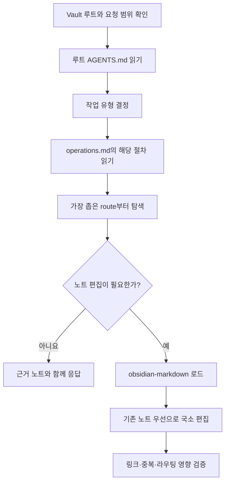

# LLM Wiki Router 사용법

`llm-wiki-router`는 기존 Obsidian vault를 LLM용 지식 위키로 탐색하고 유지하는 Agent Skill이다. 루트 `AGENTS.md`를 의미 기반 라우팅 맵으로 사용하며, 필요한 노트부터 좁게 읽고 기존 구조와 작성자의 내용을 보존한다.

일반적인 Agent Skill 설치와 관리 방법은 [[LLMS/Subagents-Format/agents-guide|`.agents`, Skills, and MCP]]를 참고한다.

## 선행조건

### 1. `npx skills` 실행 환경

Node.js와 npm이 설치되어 `npx`를 실행할 수 있어야 한다.

```bash
node --version
npm --version
npx skills --help
```

### 2. `obsidian-markdown` 설치

`llm-wiki-router`로 vault 노트를 만들거나 크게 수정할 때는 `obsidian-markdown` Skill을 함께 사용해야 한다. 현재 설치 출처는 `kepano/obsidian-skills`이다.

Codex에서 사용자 전역 Skill로 설치:

```bash
npx skills add kepano/obsidian-skills --skill obsidian-markdown -a codex -g
```

프로젝트에만 설치하려면 `-g`를 제외한다.

```bash
npx skills add kepano/obsidian-skills --skill obsidian-markdown -a codex
```

설치 상태 확인:

```bash
npx skills list
```

> [!important] 역할 구분
> `llm-wiki-router`는 **어디를 읽고 어디에 지식을 둘지** 결정한다. `obsidian-markdown`은 frontmatter, wikilink, callout, embed 등 **Obsidian 노트 문법과 작성 형식**을 담당한다.

### 3. `llm-wiki-router` 준비

`llm-wiki-router` Skill 폴더에는 최소한 다음 파일이 있어야 한다.

```text
llm-wiki-router/
├── SKILL.md
└── references/
    └── operations.md
```

공개 또는 사설 GitHub 저장소에서 배포한다면 해당 저장소를 지정해 설치할 수 있다.

```bash
npx skills add <owner>/<repository> --skill llm-wiki-router -a codex -g
```

> [!note]
> 현재 로컬 `llm-wiki-router`는 `npx skills` 잠금 파일에 설치 출처가 기록되어 있지 않다. 따라서 실제 재설치 명령에는 이 Skill을 배포하는 저장소 주소를 별도로 지정해야 한다.

### 4. Vault 루트의 `AGENTS.md`

Vault 루트에는 다음 정보를 간결하게 담은 `AGENTS.md`가 권장된다.

- 지식 도메인과 주요 폴더
- 각 도메인의 hub 또는 entry note
- 좁게 탐색하기 위한 navigation strategy
- 노트 생성·연결·기존 콘텐츠 보호 규칙

`AGENTS.md`는 노트 내용을 복제하는 카탈로그가 아니라, 질문을 적절한 노트로 보내는 의미 기반 라우팅 맵이다.

## 작업 유형

요청을 받으면 다음 작업 중 하나로 분류한 뒤 `references/operations.md`에서 해당 절차를 읽는다.

| 작업 | 사용 시점 | 기본 동작 |
| --- | --- | --- |
| `BOOTSTRAP` | 라우팅 맵을 처음 만들 때 | vault를 조사하고 루트 `AGENTS.md`를 생성한다 |
| `REFRESH` | 노트나 폴더 변경 후 | 변경된 영역과 인접 링크를 확인해 라우팅을 갱신한다 |
| `ROUTE` | 관련 지식의 위치만 찾을 때 | 폴더, hub, entry note와 선택 이유를 제시한다 |
| `QUERY` | vault 지식으로 답할 때 | 관련 노트를 읽고 `[[wikilink]]`로 근거를 표시한다 |
| `ADD` | 새 지식을 통합할 때 | 중복을 검색하고 가장 적합한 기존 노트에 우선 추가한다 |
| `SYNTHESIZE` | 여러 노트의 재사용 가능한 결론을 만들 때 | 출처, 해석, 미해결 사항을 구분해 종합 노트를 작성한다 |
| `ORGANIZE` | 탐색 구조를 개선할 때 | 이동보다 link, alias, hub 보강을 우선한다 |
| `LINT` | vault 상태를 점검할 때 | 깨진 링크, 중복, orphan, 오래된 route 등을 보고한다 |

## 기본 실행 흐름



탐색 순서는 다음과 같다.

1. `AGENTS.md`에서 가장 관련 있는 route를 선택한다.
2. 지정된 hub 또는 entry note를 먼저 읽는다.
3. 문맥상 필요한 wikilink만 따라간다.
4. 부족하면 파일명, 제목, alias를 검색한다.
5. 그래도 부족하면 노트 내용을 검색한다.
6. 가능하고 필요할 때만 semantic 또는 vector search를 사용한다.

## 사용 예시

### Vault에서 답 찾기

```text
$llm-wiki-router
이 vault에서 Codex MCP 설정 방법을 찾아 설명해줘. 노트는 수정하지 말고 근거 노트를 wikilink로 표시해줘.
```

이 요청은 `QUERY`로 처리한다. 답변을 위한 읽기만 허용되며 노트를 새로 만들지 않는다.

### 새 지식 추가

```text
$llm-wiki-router $obsidian-markdown
npx skills의 전역 설치와 프로젝트 설치 차이를 기존 노트와 중복되지 않게 정리해서 추가해줘.
```

이 요청은 `ADD`로 처리한다. 정확한 제목, alias, 파일명, 관련 문구를 먼저 검색하고 명확한 소유 노트가 있으면 그 노트를 국소적으로 보강한다.

### 라우팅 맵 갱신

```text
$llm-wiki-router
최근 추가된 LLMS 폴더의 노트를 확인하고 AGENTS.md 라우팅을 갱신할 필요가 있는지 검토해줘.
```

이 요청은 `REFRESH`로 처리한다. 새 도메인, 이동한 hub, 잘못된 entry point처럼 탐색 구조가 실질적으로 바뀐 경우에만 `AGENTS.md`를 수정한다.

### Vault 상태 점검

```text
$llm-wiki-router
LLMS 폴더 범위에서 깨진 wikilink, 중복 후보, orphan note를 점검해줘. 자동 수정은 하지 마.
```

이 요청은 범위가 제한된 `LINT`다. 확실한 오류와 개선 제안을 구분해서 보고하고, 애매한 항목을 임의로 수정하지 않는다.

## 안전 원칙

> [!warning] 요청 범위를 권한으로 해석하지 않기
> 질문에 답하거나 경로를 찾아달라는 요청은 노트 편집, 폴더 재구성, 라우팅 갱신 권한을 의미하지 않는다. 편집은 사용자가 명시적으로 요청한 경우에만 수행한다.

- 전체 vault 재귀 검색은 bootstrap, 전체 audit, 좁은 탐색 실패처럼 필요한 경우에만 수행한다.
- 기존 hub, 폴더, 파일명, alias, 작성 언어와 문체를 우선한다.
- 새 노트를 만들기 전에 동일하거나 겹치는 노트를 검색한다.
- 폴더 이동이나 노트 이름 변경보다 의미 있는 wikilink와 alias 추가를 우선한다.
- 이동, 이름 변경, 병합, 분할, 삭제 전에는 영향 범위를 제시하고 명시적 승인을 받는다.
- `AGENTS.md`는 주요 경로가 실제로 바뀐 경우에만 수정한다.

## 완료 확인

- [ ] 가장 작은 관련 route에서 시작했는가?
- [ ] 기존 지식과 중복 여부를 먼저 확인했는가?
- [ ] 편집 시 `obsidian-markdown`을 적용했는가?
- [ ] 작성자의 기존 표현, 구조, 언어와 의도를 보존했는가?
- [ ] 필요한 문맥에만 wikilink를 추가했는가?
- [ ] `AGENTS.md`를 불필요하게 변경하지 않았는가?
- [ ] 변경된 노트와 링크가 Obsidian에서 정상적으로 해석되는가?

## 관련 자료

- [[LLMS/Subagents-Format/agents-guide|`.agents`, Skills, and MCP]]
- [Obsidian Skills](https://github.com/kepano/obsidian-skills)
